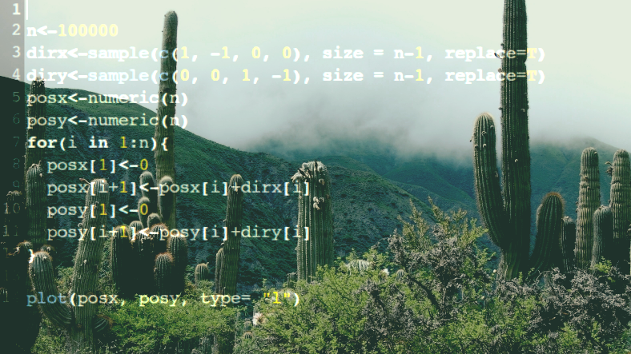
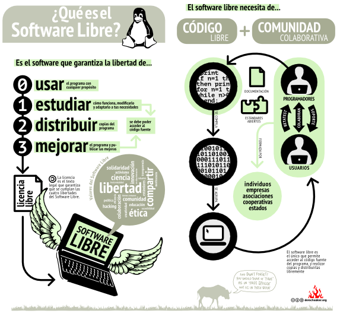
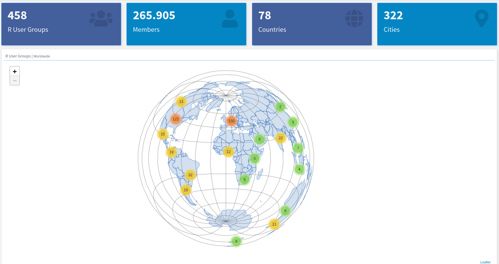
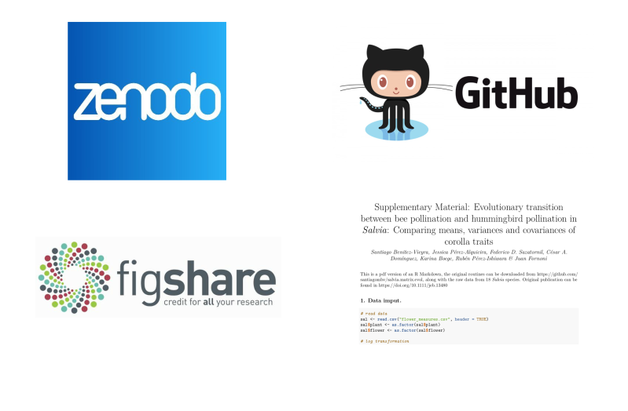
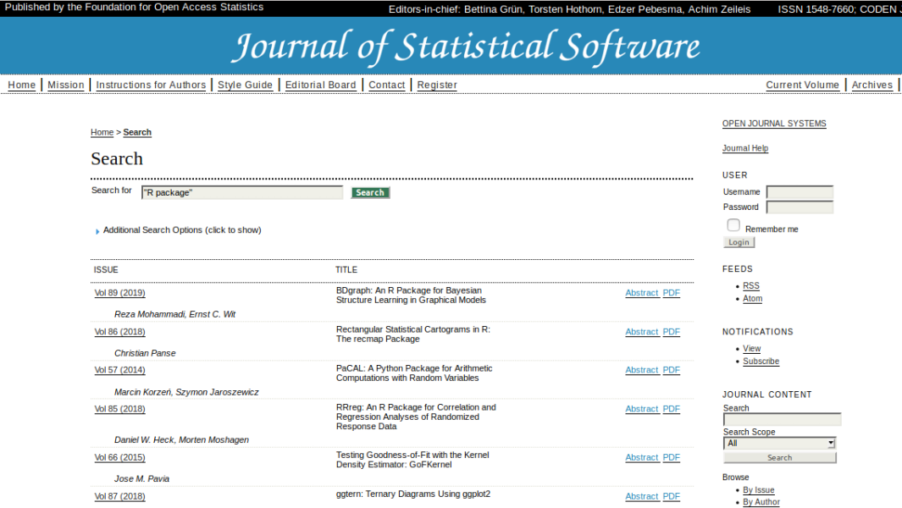
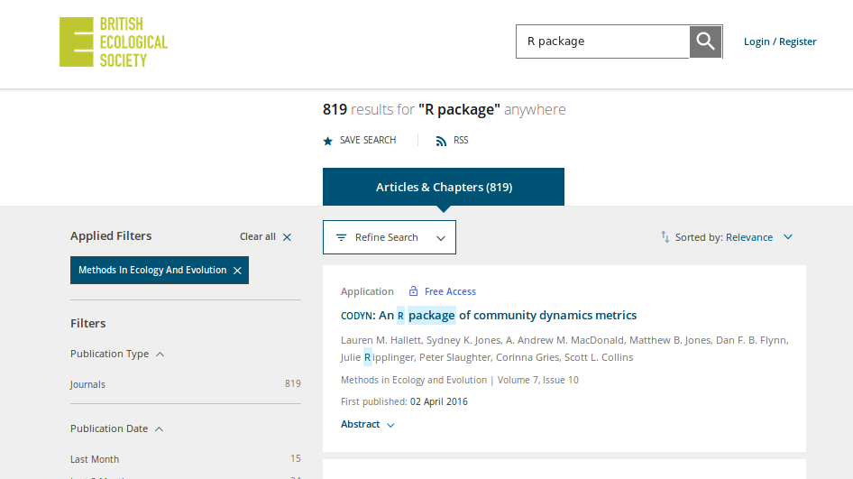
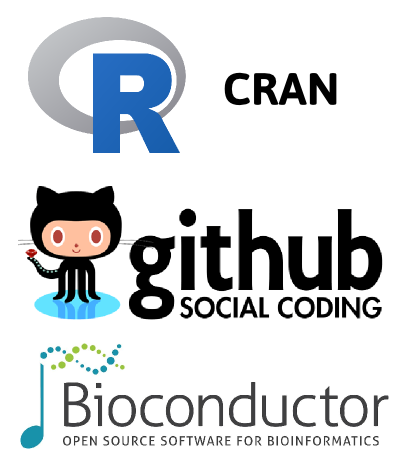
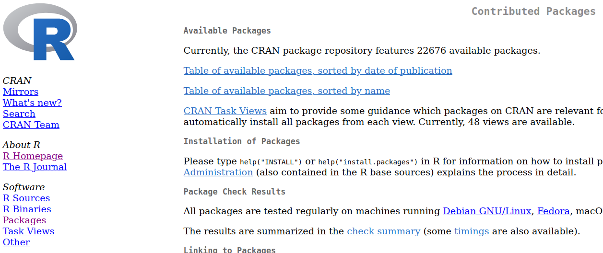
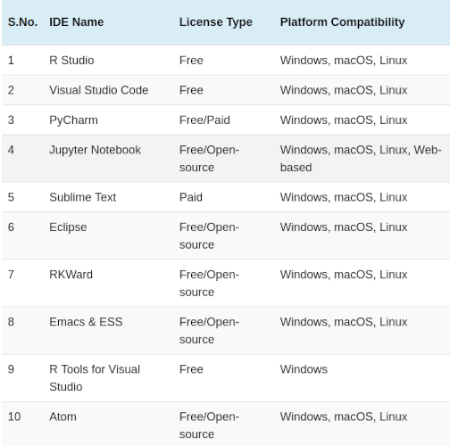

class: center, middle

```{r include=FALSE} 
library(knitr)                              # paquete que trae funciones utiles para R Markdown
library(tidyverse)                          # paquete que trae varios paquetes comunes en el tidyverse
library(fontawesome)                        # paquete para iconos
# opciones predeterminadas
knitr::opts_chunk$set(echo = FALSE,         # FALSE: los bloques de código NO se muestran
                      dpi = 300,            # asegura gráficos de alta resolución
                      warning = FALSE,      # los mensajes de advertencia NO se muestran
                      error = FALSE)        # los mensajes de error NO se muestran
```

## ¿Por qué R?  



---
class: center, middle



---
class: center, middle


Ross Ihaka y Robert Gentleman

.left[*Ihaka, Ross., & Gentleman, Robert. (1996). R: A Language for Data Analysis and Graphics. Journal of Computational and Graphical 
Statistics, 5(3), 299.*]    

---
class: center, middle

### R Core Team (actual)

Douglas Bates - John Chambers - Peter Dalgaard - Robert Gentleman - Kurt Hornik - Ross Ihaka - Tomas Kalibera - Michael Lawrence - 
Friedrich Leisch - Uwe Ligges - Thomas Lumley - Martin Maechler - Sebastian Meyer - Paul Murrell - Martyn Plummer - Brian Ripley - 
Deepayan Sarkar - Duncan Temple Lang - Luke Tierney - Simon Urbanek

*R Core Team (2025). R: A language and environment for statistical computing. R Foundation for Statistical Computing, Vienna, Austria. 
URL https://www.R-project.org/.*

---
class: center, middle

### La comunidad



R users groups, R-Ladies

---
background-color: #E6F4BC
class: center, middle

## ¿Para qué vamos a usar R en este curso? 

---

### Lenguaje para construir una rutina de análisis.
```{r, eval=FALSE, echo=TRUE}
library(vegan)
dat <- read.table("/home/santiago/mandevilla.txt", header = TRUE)

## multidimensional scaling
m1 <- metaMDS(dat2, dist = "bray", k = 2)
m1

## figura
plot(m1, "sites", type = "n") 
points(m1$points[,1],
       m1$points[,2],
       pch = c(rep(1, 4), rep(19, 4), rep(19, 3),
               rep(1, 5), rep(19, 4), rep(1, 4)), 
       col = c(rep("blue4", 4), rep("blue4", 4), rep("red4", 3), 
      rep("red4", 5), rep("green4", 4), rep("green4", 4)))

## agregar compuestos
points(m1, "species", pch = 2, cex = 0.7)
## agregar nombres de compuestos
text(m1$species[, 1], m1$species[, 2] - 0.1, colnames(dat2), cex = 0.6)
```

---

### Guardar las instrucciones de un gráfico.

```{r, eval=FALSE, echo=TRUE}
library(ggridges)
library(ggplot2)
 
# Diamonds dataset is provided by R natively
# head(diamonds)
 
# basic example
ggplot(diamonds, aes(x = price, y = cut, fill = cut)) +
  geom_density_ridges() +
  theme_ridges() + 
  theme(legend.position = "none")
```

---

### Guardar las instrucciones de un gráfico.
```{r, eval=TRUE, echo=FALSE, fig.height = 5, fig.width = 7, message=FALSE}
library(ggridges)
library(ggplot2)
 
# Diamonds dataset is provided by R natively
#head(diamonds)
 
# basic example
ggplot(diamonds, aes(x = price, y = cut, fill = cut)) +
  geom_density_ridges() +
  theme_ridges() + 
  theme(legend.position = "none")
```

---
background-color: #E6F4BC
class: center, middle

### Usar R para que la investigación sea REPRODUCIBLE 
*Métodos cuidadosamente descriptos*   
*Datos de libre disponibilidad*   
*Código del análisis estadístico*   

---

### Publicar la rutina de análisis



---

### Algunas ventajas y desventajas

|             | Zenodo   | Figshare | GitHub   | Supplementary Material |
|-------------|----------|----------|----------|----------|
| Licencia | flexible | MIT | flexible | no |
| A largo plazo? | si* | si | no | si* |
| Asigna DOI? | si | si | no | no |
| Permite buscar código?| si | si | si | no |
| Conexión con GitHub? | si | no | si | no |
| Costo para el autor | no | no | no | no* |

Modificado de [Mislan et al. 2016](https://www.sciencedirect.com/science/article/pii/S0169534715002906) 

---

### Publicar un paquete



--- 



---

### Dónde encontrar un paquete



---

### CRAN 



---

### ¿Dónde usamos R? 
Interfaces Gráficas de Usuario (GUI)     
Entorno de Desarrollo Integrado (IDE)  



---
class: center, middle


---

### ¿Dónde buscar ayuda?

- Google...    
- [CRAN Task Views](https://cran.r-project.org/web/views/) Árido como sólo R sabe. 
- [Stackoverflow](http://stackoverflow.com/) Consultas cero amigables. 
- [The R Graph Gallery](https://www.r-graph-gallery.com/) Era mejor sin publicidad.
- [Quick R](http://www.statmethods.net/) Estadísticas muy básicas desde 1997.
- [ChatGPT](https://chat.openai.com/) Inventa cositas.
- [DeepSeek](https://www.deepseek.com/) Lo mismo pero del otro lado.
- [Copilot](https://github.com/copilot) Metiche, pero tiene IAs interesantes.

---
background-color: #E6F4BC

### Contenidos del curso.   

** Este año voy a probar reorganizar las clases, para próximos años voy a dejar de dar la introducción al lenguaje **

- Funciones básicas de R (creación de objetos, ingreso de datos, análisis básicos). Análisis gráfico. Modelos Lineales. Training and Test. Selección de variables, selección de modelos y regularización. 
- Manejo de gráficos básicos: Comandos gráficos de alto y bajo nivel, exportación de gráficos. Elección del gráfico adecuado para representar un análisis. Introducción a los paquetes lattice, y ggplot2.
- Construcción de rutinas. Introducción a R Markdown. Cómo presentar los resultados.
- Introducción a la programación: Construcción de funciones, bucles y funciones condicionales.
- Métodos de remuestreo y randomizaciones. Bootstrap.

---
background-color: #E6F4BC

### Objetivos del curso.

- Adquirir destreza en el uso del lenguaje R para su uso en estadística básica y gráficos, así como nociones de programación.   
- Desarrollar una visión sobre los fundamentos de una amplia clase de modelos estadísticos.   
- Adquirir destreza en la interpretación de análisis estadísticos y gráficos.

---
background-color: #E6F4BC

### Cronograma

ver [PÁGINA DEL CURSO](https://curso-statscba.github.io/curso-R/)   

---
background-color: #E6F4BC

### Trabajo Final

Construcción de una rutina de resolución de problemas estadísticos y gráficos. Entrega de un informe, 15 días después de que el curso acabe.
     
---
