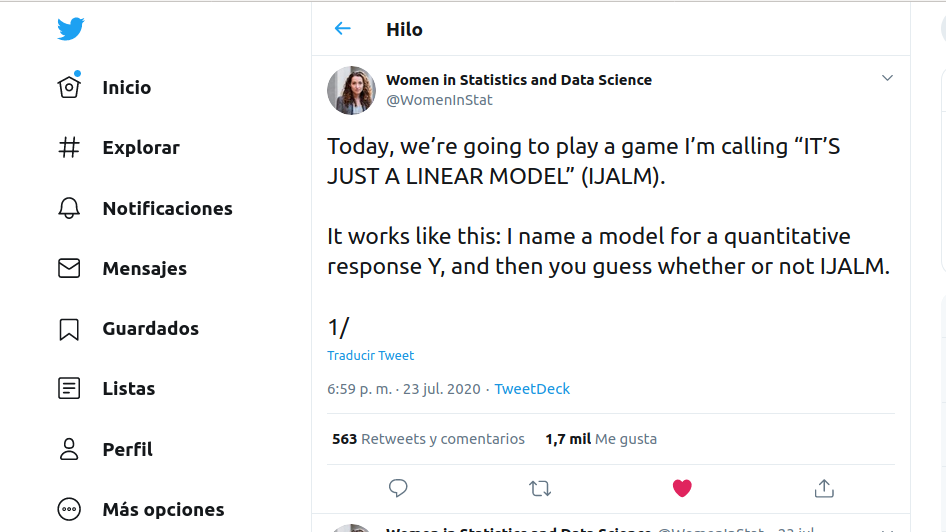
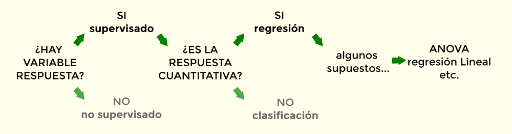
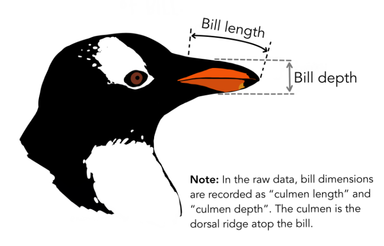

background-color: #E6F4BC
class: center, middle

```{r include=FALSE} 
library(knitr)                              # paquete que trae funciones utiles para R Markdown
library(tidyverse)                          # paquete que trae varios paquetes comunes en el tidyverse
library(fontawesome)                        # paquete para iconos
# opciones predeterminadas
knitr::opts_chunk$set(echo = FALSE,         # FALSE: los bloques de código NO se muestran
                      dpi = 300,            # asegura gráficos de alta resolución
                      warning = FALSE,      # los mensajes de advertencia NO se muestran
                      error = FALSE)        # los mensajes de error NO se muestran
```

## Introducción General

---

### ¿Qué es un modelo?

- **Economía del pensamiento.** Presentar sets de datos en una forma fácil de entender, revelando estructuras o 
relaciones. 
- **Inferir un fenómeno no observado.** Asumen cierta *uniformidad de la naturaleza* (descripta por un modelo 
probabilístico) para permitir un razonamiento inductivo. Un *modelo estadístico* es una aproximación 
instrumental que permite resolver esta tarea.

> G. Box: "Todos los modelos están equivocados, algunos son útiles."

---

### ¿Qué significan las diferentes maneras de utilizar un modelo?

- Bajo el marco **Frecuentista** la probabilidad es una propiedad colectiva, indistinguible de la frecuencia. 
Por lo tanto, una hipótesis no puede ser aceptad o rechazada, pero puede ser expresada con la lógica 
de los *mundos posibles*: ¿En cuátos "mundos" la hipótesis nula es rechazada? eso es el valor *P*. 
- Entonces, la estadística frecuentista no juzaga la verdad o falsedad de una hipótesis, pero itenta 
proporcionar reglas sistemáticas para decidir sobre los modelos probabilísticos que originan los datos. 
*Provee de herramientas de diagnóstico*.
- Finalmente, bajo el frecuentismo la *predicción* es solamente una subtarea dentro del marco general de 
la inferencia. Más adelante veremos cómo se vuelve la tarea central en el aprendizaje maquinal.

---

### Pero no confiar ciegamente...

[American Statistical Association declaration on P-values](https://www.tandfonline.com/doi/full/10.1080/00031305.2016.1154108#d1e920)

* Los valores *P* pueden indicar la incompatibilidad de los datos con un modelo estadístico determinado.      
* Los valores *P* no miden la probabilidad de que la hipótesis estudiada sea cierta, ni la probabilidad de 
que los datos se hayan producido únicamente por azar.     
* Las conclusiones científicas y las decisiones no deben basarse únicamente en si un valor *P* supera un umbral 
específico.   
* Una inferencia adecuada requiere información completa y transparencia.   
* Un valor *P*, o significación estadística, no mide el tamaño de un efecto o la importancia de un resultado.   
* Por sí mismo, un valor *P* no proporciona una buena medida de la evidencia respecto a un modelo o hipótesis.   

---

background-color: #E6F4BC
class: center, middle

## Modelos Lineales

---

### Introducción a los Modelos Lineales



**Es Solo Un Modelo Lineal! (ESUML!)**

---
### Introducción a los Modelos Lineales



---
background-color: #FFEEBD

## Modelos Lineales

Respuesta = Modelo + Error
$$Y_{i} = \beta_{0} + \beta_{1}X_{1i} + \epsilon_{i}$$   
   
* El modelo es lineal porque los parámetros se combinan linealmente.   
* Ningún parámetro es multiplicado o dividido por otro o aparece como exponente.   
* Las variables independientes pueden ser no-lineales 
(por lo cual el modelo lineal puede representar relaciones curvilíneas).    

---
background-color: #FFEEBD

## Regresión lineal simple
$$Y_{i} = \beta_{0} + \beta_{1}X_{1i} + \epsilon_{i}$$
$$X_{i} \sim continua$$

* Dos variables están relacionadas. Una de ellas informa sobre la otra
* La variable independiente brinda una explicación sobre la dependiente
* La variable independiente causa la dependiente

---
class: center, middle

```{r, echo=FALSE, fig.height=5.5}
set.seed(123)
X <-rnorm(100, mean = 90, sd=20)
Y <- 100 - 0.4*X + rnorm(100, 0, 10)
plot(X, Y, xlab = "árboles por hectárea",
     ylab = "DAB", pch = 19)
```

---
class: center, middle

```{r, echo=FALSE, fig.height=5.5}
set.seed(123)
X <-rnorm(100, mean = 90, sd=20)
Y <- 100 - 0.4*X + rnorm(100, 0, 10)
fit <- lm(Y ~ X)
plot(X, Y, xlab = "árboles por hectárea",
     ylab = "DAB", pch = 19)
abline(fit, lwd = 2)
```

---
class: center, middle

```{r, echo=FALSE, fig.height=5.5}
set.seed(123)
X <-rnorm(100, mean = 90, sd=20)
Y <- 100 - 0.4*X + rnorm(100, 0, 10)
fit <- lm(Y ~ X)
Yhat <- predict(fit)
plot(X, Y, xlab = "árboles por hectárea",
     ylab = "DAB", pch = 19)
abline(fit, lwd = 2)
segments(X, Y, X, Yhat, col = "red")
```

---

```{r, echo=FALSE, eval=TRUE, results='hold'}
set.seed(123)
X <-rnorm(100, mean = 90, sd=20)
Y <- 100 - 0.4*X + rnorm(100, 0, 10)
fit <- lm(Y ~ X)
summary(fit)
```

---
class: center, middle

```{r, echo=FALSE, fig.height=5.5}
set.seed(123)
X <-rnorm(100, mean = 90, sd=20)
Y <- 100 - 0.4*X + rnorm(100, 0, 10)
set.seed(123)
X <-rnorm(100, mean = 90, sd=20)
Y <- 100 - 0.4*X + rnorm(100, 0, 10)
fit <- lm(Y ~ X)
Yhat <- predict(fit)
#par(bg = "grey80")
plot(X, Y, xlab = "árboles por hectárea",
     ylab = "DAB", pch = 19)
abline(fit, lwd = 2)
abline(h = mean(Y), lty = 3, lwd = 2)
o <- which.max(Y)
points(X[o], Y[o], pch = 19, col = "purple", cex = 2)
arrows(X[o], Y[o], X[o], Yhat[o], col = "red2", lwd = 2)
arrows(X[o], Yhat[o], X[o], mean(Y), col = "green3", lwd = 2)
arrows(X[o]+5, Y[o], X[o]+5, mean(Y), col = "cyan3", lwd = 2)
```

---
background-color: #FFEEBD

### Ajuste del modelo

$$\color{green}{{SS_{modelo}} = \sum(\hat{y_{i}}-\bar{y})^2}$$
    
$$\color{red}{SS_{residual} = \sum({y_{i}}-\hat{y_{i}})^2}$$
    
$$\color{blue}{SS_{total} = \sum({y_{i}}-\bar{y})^2}$$
    
$$R^2 = \frac{SS_{modelo}}{SS_{total}}$$ 
    
$$R^2 = 1 - \frac{SS_{residual}}{SS_{total}}$$   

---

### Ajuste del modelo

* El $R^2$ nos dice que proporción de la variación de la variable dependiente es explicada por  la variación en la variable independiente.   
* El $F$ del Anova y su $P$ asociado nos dicen si la porción de la varianza explicada por la regresión es significativa.   
* El $t$ y su $P$ asociado indican la significancia del coeficiente de regresión. Esto es, prueban la hipótesis nula de que $\beta = 0$.  

---

### Con una serie de supuestos...

* La variable x es **medida sin error**. Es decir es una variable fija.   
* **Linealidad**. El valor de y para cada valor de x es descripto por una función lineal.   
* **Normalidad**. Para cada valor de x las y son independientes y se distribuyen normalmente. Por lo que… los residuos se distribuyen normalmente.   
* **Homogeneidad de varianzas**. La varianza alrededor de la línea de regresión es constante e independiente de los valores de x o y.   
* **Independencia**. Los valores de y  y los errores son independientes unos de otros.   

---
class: center, middle

```{r, echo=FALSE, fig.height=5.5}
set.seed(123)
X <-rnorm(100, mean = 90, sd=20)
Y <- 100 - 0.4*X + rnorm(100, 0, 10)
fit <- lm(Y ~ X)
layout(matrix(1:4,2,2))
plot(fit)
layout(1)
```

---
class: center, middle

```{r, echo=FALSE, fig.height=5.5}
set.seed(123)
X <-rnorm(100, mean = 90, sd=20)
Y <- 100 - 0.4*X + rnorm(100, 0, 10)
fit <- lm(Y ~ X)
library(performance)
check_model(fit)
```

---

### Influencia

* **Residuos:** miden la distancia desde el valor observado de y hasta la recta de regresión.
* **Leverage:** es una medida de cuan extrema es una observación en x. Detecta outliers en x.
* **Distancia de Cook o influencia:** combinación de las dos anteriores. Si un punto tiene un alto leverage y un gran error, es muy influyente.

---
class: center, middle

```{r, echo=FALSE, fig.height=5.5}
set.seed(1234)
X <-rnorm(100, mean = 90, sd=20)
Y <- 100 - 0.4*X + rnorm(100, 0, 10)
Ynew <- c(Y, 100)
Xnew <- c(X, 130)
fit <- lm(Y ~ X)
fit2 <- lm(Ynew ~ Xnew)
plot(X, Y, xlab = "árboles por hectárea",
     ylab = "DAB", pch = 19)
abline(fit, lwd = 2)
abline(fit2, lwd = 2, col="purple2")
abline(h = mean(Y), lty = 3, lwd = 2)
abline(v = mean(X), lty = 3, lwd = 2)
points(130, 100, pch=19, cex = 2, col="purple2")
arrows(130, 100, 130, predict(fit2)[101])
arrows(130, 100, mean(X), 100)
o <- which.max(Y)
```

---
class: center, middle

```{r, echo=FALSE, fig.height=5.5}
set.seed(123)
X <-rnorm(100, mean = 90, sd=20)
Y <- 100 - 0.4*X + rnorm(100, 0, 10)
fit <- lm(Y ~ X)
library(performance)
library(see)
plot(check_outliers(fit))
```

---
background-color: #FFEEBD

### Análisis de la varianza

$$Y_{ij} = \mu + \alpha_{i} + \epsilon_{ij}$$   

* Examinar la contribución relativa de distintas fuentes de variación.
* Probar la hipótesis nula de la media poblacional y las medias para cada nivel del factor son iguales. 

---
### (Pequeña nota histórica)


*Iris* fue publicado por primera vez en **1936** por Ronald Fisher en el *Annals of Eugenics*. 
Proponía una metodología para describir "rasgos deseables" en apoyo al programa eugenésico.   

---



Desde 2021 uso como ejemplo los datos de pingüinos de tres especies (de Adelia, de barbijo y de vincha) 
del Archipiélago de Palmer (Antártida), a traves del paquete *palmerpenguins*.

---

```{r, echo=FALSE, warning=FALSE, message=FALSE, fig.height=5.5}
library(palmerpenguins)
data(penguins)
plot(bill_length_mm ~ species, data = penguins, horizontal = T, 
     ylab ="bill length (mm)", col = 5:7)

```

---

```{r, echo=FALSE, fig.height=5.5}
library(palmerpenguins)
data(penguins)
stripchart(bill_length_mm ~ species, data = penguins, col = 5:7, 
     ylab = "species", xlab = "bill length (mm)")
```

---

```{r, echo=FALSE, fig.height=5.5}
library(palmerpenguins)
data(penguins)
stripchart(bill_length_mm ~ species, data = penguins, col = c("skyblue3", "purple", "orange"), 
     xlab = "bill length (mm)", ylab = "species")
abline(v = mean(penguins$bill_length_mm, na.rm = T), lwd = 2)
abline(v = mean(subset(penguins$bill_length_mm, penguins$species == "Adelie"), na.rm = T), 
       col = "skyblue3", lwd = 2, lty = 3)
abline(v = mean(subset(penguins$bill_length_mm, penguins$species == "Chinstrap"), na.rm = T), 
       col = "purple", lwd = 2, lty = 3)
abline(v = mean(subset(penguins$bill_length_mm, penguins$species == "Gentoo"), na.rm = T), 
       col = "orange", lwd = 2, lty = 3)
```

---

```{r, echo=FALSE, fig.height=5.5}
library(palmerpenguins)
data(penguins)
stripchart(bill_length_mm ~ species, data = penguins, col = c("skyblue3", "purple", "orange"), 
     xlab = "bill length (mm)", ylab = "species")
abline(v = mean(penguins$bill_length_mm, na.rm = T), lwd = 2)
abline(v = mean(subset(penguins$bill_length_mm, penguins$species == "Adelie"), na.rm = T), 
       col = "skyblue3", lwd = 2, lty = 3)
abline(v = mean(subset(penguins$bill_length_mm, penguins$species == "Chinstrap"), na.rm = T), 
       col = "purple", lwd = 2, lty = 3)
abline(v = mean(subset(penguins$bill_length_mm, penguins$species == "Gentoo"), na.rm = T), 
       col = "orange", lwd = 2, lty = 3)

points(max(penguins$bill_length_mm, na.rm =T), 3, pch = 19, col = "yellow4", cex = 2)
arrows(max(penguins$bill_length_mm, na.rm =T), 2.9, 
       mean(subset(penguins$bill_length_mm, penguins$species == "Gentoo"), na.rm = T), 2.9,
       col = "red3", lwd = 2)
arrows(mean(subset(penguins$bill_length_mm, penguins$species == "Gentoo"), na.rm = T), 2.9,
       mean(penguins$bill_length_mm, na.rm = T), 2.9, col = "green3", lwd = 2)
arrows(max(penguins$bill_length_mm, na.rm =T), 2.8, 
       mean(penguins$bill_length_mm, na.rm = T), 2.8,
       col = "cyan3", lwd = 2)
```

---
background-color: #FFEEBD

### Ajuste del modelo

$$\color{green}{{SS_{modelo}} = \sum(\hat{y_{i}}-\bar{y})^2}$$
    
$$\color{red}{SS_{residual} = \sum({y_{i}}-\hat{y_{i}})^2}$$
    
$$\color{blue}{SS_{total} = \sum({y_{i}}-\bar{y})^2}$$
    
$$R^2 = \frac{SS_{modelo}}{SS_{total}}$$ 
    
$$R^2 = 1 - \frac{SS_{residual}}{SS_{total}}$$   

---

### Ajuste del modelo

```{r}
library(palmerpenguins); data("penguins")
fit <- lm(bill_length_mm ~ species, data = penguins)
anova(fit)
```

---

### Ajuste del modelo

```{r}
library(palmerpenguins); data("penguins")
fit <- lm(bill_length_mm ~ species, data = penguins)
summary(fit)
```

---
background-color: #FFEEBD

### ¿Por qué hay una salida de regresión para un ANOVA?   

$$Y_{ij} = \mu + \alpha_{i} + \epsilon_{ij}$$
$$Y_{ij} = \beta_{0} + \beta_{1}X_{i1} + ... \beta_{j}X_{ij} + \epsilon_{ij}$$  

---
background-color: #FFEEBD

### ¿Por qué hay una salida de regresión para un ANOVA?   

$$Y_{ij} = \beta_{0} + \beta_{dummy1}X_{i1} + \beta_{dummy2}X_{i, dummy2} + \epsilon_{ij}$$

$$Y_{i, Adelie} = \beta_{0} + \epsilon_{ij}$$

$$Y_{i, Chinstrap} = \beta_{0} + \beta_{dummy1} + \epsilon_{ij}$$

$$Y_{i, Gentoo} = \beta_{0} + \beta_{dummy2} + \epsilon_{ij}$$


### Dummies   
1. **dummy 1** Adelia = 0, Barbijo = 1, Vincha = 0   
2. **dummy 2** Adelia = 0, Barbijo = 0, Vincha = 1      
3. Si dummy 1 = 0 y dummy 2 = 0, entonces es un pingüino de Adelia!    

---

```{r}
library(palmerpenguins); data("penguins")
fit <- lm(bill_length_mm ~ species, data = penguins)
summary(fit)
```

---

### Ajuste del modelo

* El $R^2$ nos dice que proporción de la variación de la variable dependiente es explicada por  la variación en la variable independiente.   
* El $F$ del Anova y su $P$ asociado nos dicen si la porción de la varianza explicada por la regresión es significativa.   
* El t y su P asociado indican la significancia del coeficiente de la *dummy*. Esto es, si la diferencia entre un tratamiento y el tratamiento (especie) tomado como referencia es significativa.   

---

```{r, echo=FALSE, fig.height=5.5}
library(palmerpenguins); data("penguins")
fit <- lm(bill_length_mm ~ species, data = penguins)
layout(matrix(1:4,2,2))
plot(fit)
layout(1)
```

---

```{r, echo=FALSE, fig.height=5.5}
library(palmerpenguins); data("penguins")
fit <- lm(bill_length_mm ~ species, data = penguins)
library(performance)
check_model(fit)
```

---

### Los diagnósticos que todos odiamos

```{r, echo=TRUE}
library(palmerpenguins); data("penguins")
fit <- lm(bill_length_mm ~ species, data = penguins, na.action = na.exclude)
shapiro.test(residuals(fit))
bartlett.test(residuals(fit) ~ penguins$species)
```
---
