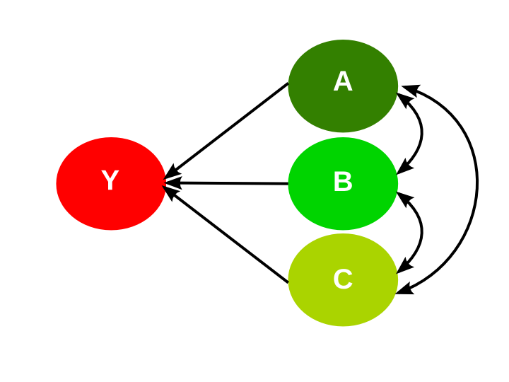
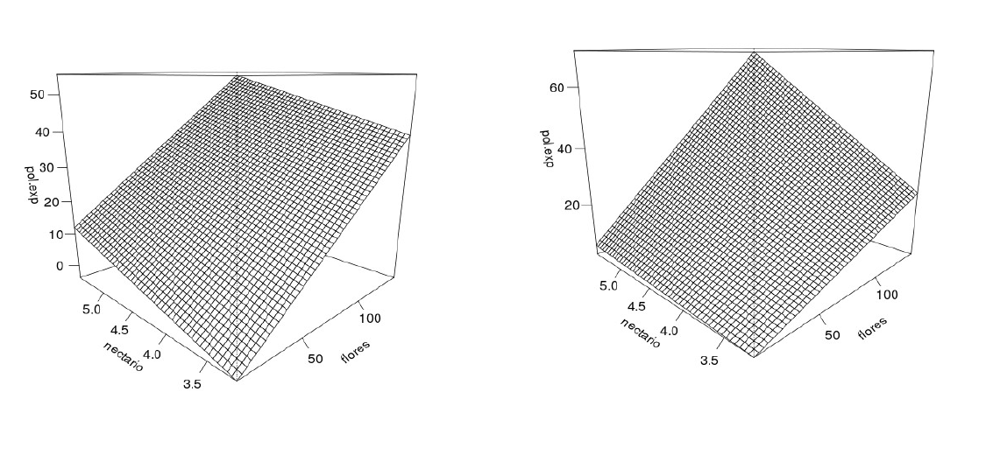
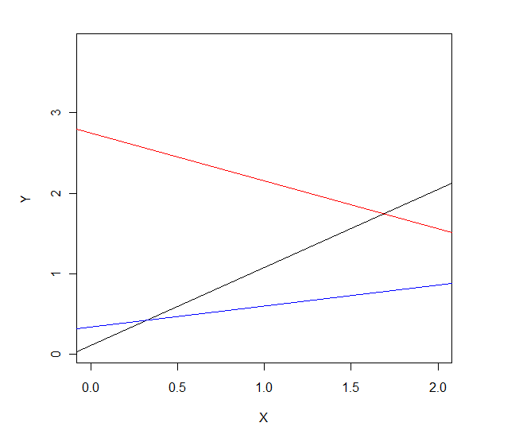

background-color: #E6F4BC
class: center, middle

## Regresión lineal múltiple e interacciones

---

### Modelos de múltiples variables independientes

- La interpretación de los parámetros se complica, particularmente si
existen interacciones.   
- Existen distintas maneras de incorporar las variables al modelo, en
particular ¿las variables independientes tiene un efecto secuencial o
simultáneo?   
- Existen nuevos problemas para el buen ajuste del modelo,
especialmente la colinearidad.   
- ¿Cómo elijo el mejor modelo para mis datos? ¿debo predecir o
explicar un patrón?

---
### Notación 

**Representación** | **Modelo**
--- | --- 
`Y ~ 1` | regresión por el origen, modelo sin efecto
`Y ~ A` | regresión lineal simple y ANOVA
`Y ~ A - 1` | regresión con intercepto en cero
`Y ~ A + B` | modelo lineal múltiple sin interacción
`Y ~ A*B` | modelo lineal múltiple con interacción
`Y ~ A + B + A:B` | idem anterior
`Y ~ (A + B + C)^2` | modelo con todas las interacciones de grado 2
`Y ~ A + B + C + A:B + A:C + B:C` | idem anterior
`Y ~ A/B` | modelo con B anidado en A
`Y ~ A + B%in%A`| idem anterior
`Y ~ A + I(A^2)` | modelo con efecto no lineal

---

### Relaciones

$$Y_{i} = \beta_{0} + \beta_{1}X_{1i} + \beta_{2}X_{2i} + \beta_{3}X_{3i} +\epsilon_{i}$$



---
### interpretación

- El **intercepto** ($\beta_{0}$) se interpreta como el valor de la variable dependiente (y) cuando todas las variables independientes ($x$) toman un valor de 0.  
- El **coeficiente regresión parcial** ($\beta_{1}$) es la pendiente de $y$ en $x_{1}$, mide el cambio en y por cada unidad de cambio en $x_{1}$, manteniendo los valores de las demás $x$ ($x_{2}$, $x_{3}$, etc.) constantes.   
- $\beta_{1}$ mide los efectos directos de $x_{1}$ sobre $y$, descontando los efectos indirectos debidos a la correlación entre $x_{1}$ y las otras variables $x$ incluidas en el modelo.   
- Los coeficientes parciales pueden contener efectos indirectos de variables no
incluidas en el modelo.  
- El $R^2$ no aumenta linealmente porque solo incluye la variación debida a los
efectos directos.   

---

### Interacciones



---

### Sumas de Cuadrados. Tipo 1.

```{r echo=FALSE, eval=TRUE, message=FALSE}
set.seed(123)
a <- rnorm(100)
b <- a + 0.1 + rnorm(100) #simulacion
y <- 0.3 * a + 0.3 * b + 0.2 * a * b + rnorm(100)               #simulacion
fit <- lm(y ~ a * b)
library(knitr)
kable(anova(fit), digits = 3)
```

<br>

| Suma de Cuadrados | Descripción | A favor | En contra |
| ---- | ------ | ------ | ------ |
| Tipo I | Las variables son añadidas una a una, en el orden indicado en la fórmula. | No subestima la suma de cuadrados total. Preferible en modelos anidados donde hay un orden natural. | Distinto orden de los factores produce distintos resultados. |

---

### Sumas de Cuadrados. Tipo 2.

```{r, echo=FALSE, eval=TRUE, message=FALSE}
set.seed(123)
a <- rnorm(100)
b <- a + 0.1 + rnorm(100) #simulacion
y <- 0.3 * a + 0.3 * b + 0.2 * a * b + rnorm(100)               #simulacion
library(car)
library(knitr)
kable(Anova(fit, type = 2), digits = 3)
```

<br>

| Suma de Cuadrados | Descripción | A favor | En contra |
| --- | --- | --- | --- |
| Tipo II | Cada término es testeado después de introducir todos los otros, excepto las interacciones | Modelo muy usado, especialmente cuando no hay interacciones. El orden no importa. | Es sensible al desbalanceo. |

---

### Sumas de Cuadrados. Tipo 3.

```{r echo=FALSE, eval=TRUE, message=FALSE}
set.seed(123)
a <- rnorm(100)
b <- a + 0.1 + rnorm(100) #simulacion
y <- 0.3 * a + 0.3 * b + 0.2 * a * b + rnorm(100)               #simulacion
library(car)
library(knitr)
kable(Anova(fit, type = 3), digits = 3)                # SIN CONTRASTES
```

<br>

| Suma de Cuadrados | Descripción | A favor | En contra |
| --- | --- | --- | --- |
| Tipo III | Cada término es testeado después de introducir todos los otros, incluso las interacciones. | No depende del tamaño de las celdas, útil en caso de desbalanceo. | Da la misma importancia a los efectos principales y a las interacciones. |

---

### Interacciones en el ANOVA

_model = lm(fat ~ age*breed)_

<br><br>

```{r eval=TRUE, echo=FALSE, message=FALSE}
set.seed(456)
A <- c(rep(0, 100), rep(1, 100))
B <- rep(c(rep(0, 50), rep(1, 50)), 2)
y <- 10 + 0.08 * A - 0.03 * B - 1.8 * A * B + rnorm(200, 0, sd = 1.8)
datos <- data.frame(
  fat = y,
  age = as.factor(c(rep("young", 100), rep("old", 100))),
  breed = as.factor(rep(c(rep("jersey", 50), rep("canadian", 50)), 2))
)
model <- lm(fat ~ age * breed, data = datos)
library(car)
library(knitr)
kable(Anova(model, Type = 2), digits = 3)
```

---

### Interacciones en el ANOVA

_model = lm(fat ~ age*breed)_

<br><br>

```{r echo=FALSE, eval=TRUE, message=FALSE}
set.seed(456)
A <- c(rep(0, 100), rep(1, 100))
B <- rep(c(rep(0, 50), rep(1, 50)), 2)
y <- 10 + 0.08 * A - 0.03 * B - 1.8 * A * B + rnorm(200, 0, sd = 1.8)
datos <- data.frame(
  fat = y,
  age = as.factor(c(rep("young", 100), rep("old", 100))),
  breed = as.factor(rep(c(rep("jersey", 50), rep("canadian", 50)), 2))
)
model <- lm(fat ~ age * breed, data = datos)

kable(summary(model)$coefficients, digits = 4)
```

---

### Interacciones en el ANOVA

```{r, echo=FALSE}
library(sciplot)
set.seed(456)
A <- c(rep(0, 100), rep(1, 100))
B <- rep(c(rep(0, 50), rep(1, 50)), 2)
y <- 10 + 0.08 * A - 0.03 * B - 1.8 * A * B + rnorm(200, 0, sd = 1.8)
datos <- data.frame(
  fat = y,
  age = as.factor(c(rep("young", 100), rep("old", 100))),
  breed = as.factor(rep(c(rep("jersey", 50), rep("canadian", 50)), 2))
)
lineplot.CI(
  x.factor = age,
  response = fat,
  group = breed,
  data = datos,
  col = c("orange3", "skyblue3"),
  xlab = "age", ylab = "fat",
  lwd = 2,
  leg.lab = c("canadian", "jersey"),
  pch = c(19, 19)
)
```

---

### Modelos lineales con interacción
```{r, eval = F}
fit <- lm(Y ~ X * Z) # X es un CONTINUA, Z es FACTOR (a,b,c)
summary(fit)
---
  Coefficients:
            Estimate  Std. Error t value  Pr(>|t|) # nolint
(Intercept) 0.1078    0.3136     0.344    0.732958
X           0.9714    0.2561     3.793    0.000505 ***
Zb          2.6422    0.4435     5.957    5.94e-07 ***
Zc          0.2278    0.4435     0.514    0.610429
X:Zb       -1.5674    0.3622    -4.328    0.000101 ***
X:Zc       -0.7103    0.3622    -1.961    0.057013 .
---
```

---
background-color: #FFEEBD

### Modelos lineales con interacción

_fit <- lm(Y ~ X * Z) # X es un CONTINUA, Z es FACTOR (a,b,c)_

<br>

$$y = \beta_{0} + \beta_{1}X + \beta_{2}d_{1} + \beta_{3}d_{2} + \beta_{4}Xd_{1} + \beta_{5}Xd_{2} + \epsilon$$

---
background-color: #FFEEBD

### Modelos lineales con interacción

$$y = \color{Magenta}{\beta_{0} + \beta_{1}X} + \color{green} {\beta_{2}d_{1}} + \color{blue}{\beta_{3}d_{2}} + \color{green}{\beta_{4}Xd_{1}} +\color{blue}{\beta_{5}Xd_{2}} + \epsilon$$

<br>

- Para el nivel a:   
$y = \color{Magenta}{\beta_{0}} + \color{Magenta}{\beta_{1}X}$    
<br>
- Para el nivel b:   
$y = \color{Magenta}{\beta_{0}} + \color{green}{\beta_{2}d_{1}} + \color{Magenta}{\beta_{1}X} + \color{green}{\beta_{4}Xd_{1}}$    
<br>
- Para el nivel c:   
$y = \color{Magenta}{\beta_{0}} +  \color{blue}{\beta_{3}d_{2}} + \color{Magenta}{\beta_{1}X} +  \color{blue}{\beta_{5}Xd_{2}}$   

---
background-color: #FFEEBD

### Modelos lineales con interacción

$$y = \color{Magenta}{\beta_{0} + \beta_{1}X} + \color{green} {\beta_{2}d_{1}} + \color{blue}{\beta_{3}d_{2}} + \color{green}{\beta_{4}Xd_{1}} +\color{blue}{\beta_{5}Xd_{2}} + \epsilon$$

<br>

- Para el nivel a:    
$\color{Magenta}{y = 0.1078 + 0.9714 X}$  
<br>  
- Para el nivel b:    
$\color{green}{y = (0.1078 + 2.6422) + (0.9714 - 1.5674)X}$   
<br>  
- Para el nivel c:    
$\color{blue}{y = (0.1078 + 0.2278) + (0.9714 - 0.7103)X}$  

---

### Modelos lineales con interacción
```{r, eval = F}
fit <- lm(Y ~ X * Z) # X es un CONTINUA, Z es FACTOR (a,b,c)
summary(fit)
---
Coefficients:
            Estimate  Std. Error t value  Pr(>|t|)
(Intercept) 0.1078    0.3136     0.344    0.732958
X           0.9714    0.2561     3.793    0.000505 ***
Zb          2.6422    0.4435     5.957    5.94e-07 ***
Zc          0.2278    0.4435     0.514    0.610429
X:Zb       -1.5674    0.3622    -4.328    0.000101 ***
X:Zc       -0.7103    0.3622    -1.961    0.057013 .
---
```

---

### Modelos lineales con interacción



---