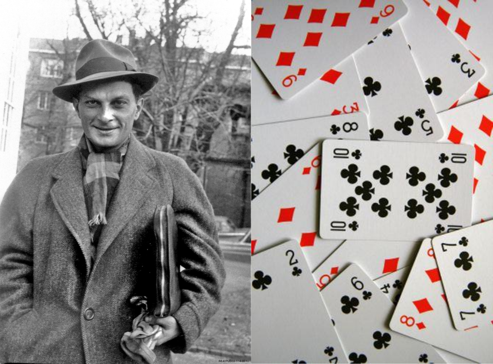
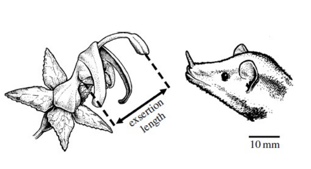
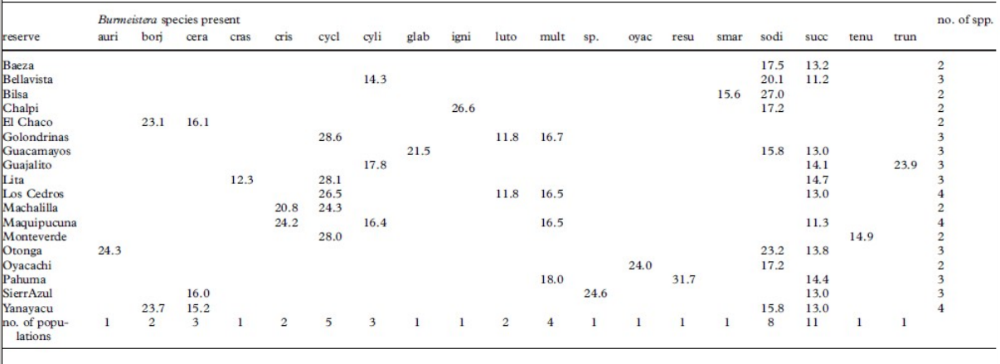

class: center, middle
### Randomización y Modelos Nulos

---
class: center, middle

> Stanisław Ulam (1909-1984), matemático y físico nuclear. "The first thoughts and attempts I made to practice 
[the Monte Carlo Method] were suggested by a question which occurred to me in 1946 as I was 
convalescing from an illness and playing solitaires".

---

### Volvamos un poquito...

- Bajo el marco **Frecuentista** la probabilidad es una propiedad colectiva, indistinguible de la frecuencia. 
Por lo tanto, una hipótesis no puede ser aceptad o rechazada, pero puede ser expresada con la lógica 
de los *mundos posibles*: ¿En cuátos "mundos" la hipótesis nula es rechazada? eso es el valor *P*. 
- Entonces, la estadística frecuentista no juzaga la verdad o falsedad de una hipótesis, pero itenta 
proporcionar reglas sistemáticas para decidir sobre los modelos probabilísticos que originan los datos. 
*Provee de herramientas de diagnóstico*.

---
background-color: #fbbbbf

### Randomizaciones

La hipótesis bajo investigación sugiere que existe algún tipo de patrón en los datos, mientras que la 
hipótesis nula dice que el patrón observado es producto del puro azar. 

 

**¿Cómo podemos generar esos mundos posibles?**
---

### Randomizaciones. 

Para aceptar o rechazar $H_{0}$ debemos:    
* Elegir un estadístico que mida en qué grado los datos observados muestran el patrón en cuestión.   
* El valor de S en los datos observados es comparado con la distribución de S obtenida al reordenar al azar 
los datos.   

---

### Randomizaciones

* Los resultados de las randomizaciones son válidos aún en
ausencia de muestreo al azar.   
* Es relativamente sencillo tomar en cuenta las peculiaridades de la situación de interés y usar 
estadísticos adecuados.
* Los estadísticos son probados contra una distribución creada *ad hoc*, por lo que no tienen las limitaciones 
de las pruebas donde el estadístico es probado contra una distribución teórica.   

---
background-color: #fbbbbf

## Modelos Nulos en Ecología

* Un modelo nulo es aquel que deliberadamente excluye el mecanismo que queremos probar y que suponemos ha 
originado un patrón en nuestros datos.   
* Se utiliza para responder la pregunta: ¿los patrones observados, podrían haberse originado en 
ausencia de determinado mecanismo?
* Si el patrón observado tiene una baja probabilidad de ser producido por el modelo nulo, nuestro 
análisis aporta alguna evidencia de que el mecanismo puesto a prueba está realmente ocurre.   

---

### Modelos Nulos en Ecología

¿Difiere la riqueza de especies de peces entre ríos contaminados y no contaminados? 
¿Existe evidencia de una separación inusual en la dieta de especies simpátricas de lagartijas? 
¿Difiere la diversidad taxonómica de aves entre una isla y la tierra firme?   

---

### Examinando desplazamiento de caracteres en *Burmeistera*.

Muchhala N, Potts M. 2007. Proc. Roy. Soc. Lond. B 274: 2731-2737.

---

### Examinando desplazamiento de caracteres en *Burmeistera*.

> Si dos especies evitan la competencia colocando el polen en sitios distintos del murciélago 
tendrán mayor éxito. Esperamos que la divergencia local en la exserción debe ser más grande 
que la esperada por azar.

---

### Examinando desplazamiento de caracteres en *Burmeistera*.

**ESTADISTICO ELEGIDO:** Media de las diferencias locales en la exserción.
La media observada de las 32 diferencias es de **6.03 mm**

---

### Examinando desplazamiento de caracteres en *Burmeistera*.
#### Modelo nulo 1
* Se permuta el orden de los datos dentro de cada columna. En este modelo nulo, la longitud de las 
flores es independiente de los sitios donde crece. 
* Se crean 1000 nuevas matrices sitio x especie y en cada una se calcula la media de las diferencias 
entre pares de especies.   

> La diferencia media en exserción por las 1000 matrices nulas fue de 5.09 con un rango entre 
3.53 a 6.09. Solamente una de las matrices nulas mostró una diferencia mayor a 6.03. 
Esto representa un valor *P* de 0.001.   

---

### Examinando desplazamiento de caracteres en *Burmeistera*.
#### Modelo nulo 2. Con constricción.

* Se permuta el orden de los datos dentro de cada columna, conservando los 0 en su lugar.   
* En este modelo nulo, cada especie crece solamente en los sitios donde fue registrada, 
pero su longitud es independiente de ese sitio.   
* Se crean 1000 nuevas matrices sitio x especie y en cada una se calcula la media 
de las diferencias entre pares de especies.   

> La diferencia media en exserción por las 1000 matrices nulas fue de 5.66 con un rango entre 
4.84 a 6.30. Solamente ocho de las matrices nulas mostró una diferencia mayor a 6.03. 
Esto representa un valor *P* de 0.008.

---
background-color: #fbbbbf

### Otras aplicaciones: Modelos lineales randomizados. 

* El mecanismo que se debe excluir del modelo es la correspondencia entre la variable 
independiente (por ejemplo los niveles del factor en un ANOVA) y la variable dependiente.   
* Para hacerlo permuto los valores de una de las dos variables y recalculo el test *F*.   
* La *F* observada en los datos originales es comparada con la distribución de las *pseudo F*
creadas en los modelos de permutación.
* Al no comparar contra una distribución *F* teórica, el modelo está libre de los 
supuestos comunes de los modelos lineales.

---

