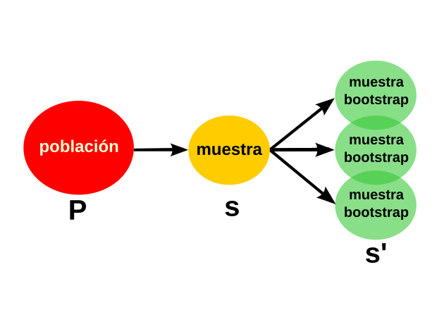
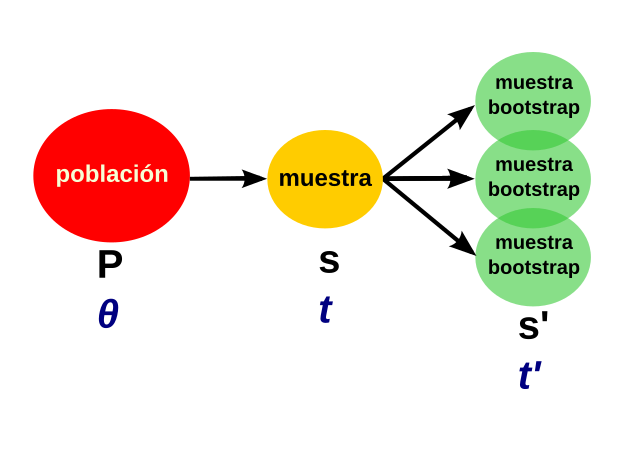
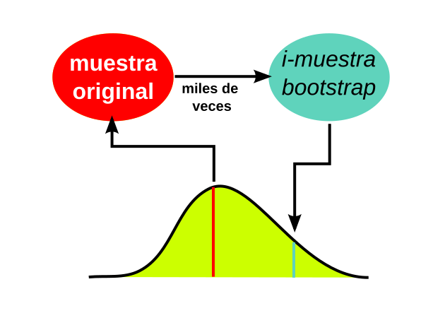

class: center, middle
background-color: #fbbbbf
### Bootstrap


---
### ¿Cómo crear los mundos posibles?

* Muestreo aleatorio original.   
* Muestreo aleatorio con reposición de igual n.   



---
class: center, middle

### La muestra-bootstrap es a la muestra, como la muestra es a la población.

Utilizamos nuestra muestra como una nueva población de la que se extraen 
muestras-bootstrap.

---

### Entonces...
 
Si calculamos un estadístico $t’$ en cada muestra-bootstrap, su distribución 
alrededor del $t$ en la muestra original es análoga a la distribución de $t$ 
alrededor del parámetro poblacional $\theta$.   



---

### ¿Para qué se usan estas nuevas muestras?


---
background-color: #fbbbbf

### Estos "mundos posibles" no son al azar

> Razonamiento inverso al de los modelos randomizados: La esperanza del 
estadístico obtenido en cada muestra-bootstrap es el valor del estadístico 
en la muestra original, *nunca* es un valor extremo.   

---

### Ejemplo sencillo.
```{r cache=TRUE}
X <- rgamma(10, 8)
X
mean(X)
sample(X, replace = T) # ejemplo
mean(sample(X, replace = TRUE)) # repetir miles de veces ...
```

---

```{r}
Bs <- replicate(100, mean(sample(X, replace = TRUE)))
Bs
mean(X)
mean(Bs)
mean(X) - mean(Bs) # sesgo
```

---

```{r, echo=FALSE}
library(ggplot2)
set.seed(123)
X <- rgamma(10, 8) # datos
Bs <- replicate(100, mean(sample(X, replace = TRUE)))
dat <- data.frame(B = Bs)
ggplot(dat, aes(x = B)) +
  geom_histogram(binwidth = 0.2, fill = "#fbbbbf", color = "black") +
  geom_vline(xintercept = mean(X), color = "blue", linetype = "dashed") +
  geom_vline(xintercept = mean(Bs), color = "red", linetype = "dashed") +
  annotate("text", x = mean(Bs), y = 10, label = "media de los bootstraps", color = "red", hjust = -0.1) +
  annotate("text", x = mean(X), y = 12, label = "media observada", color = "blue", hjust = -0.1) +
  annotate("text", x = (mean(X) + mean(Bs))/2, y = 8, label = "sesgo", color = "black", hjust = 0.5) +
  theme_minimal() +
  labs(x = "Media bootstrap", y = "Frecuencia")
```

---

### ¿Qué hacemos después de obtener la distribución del estadístico?   

* La mayor parte de los métodos se enfocan en calcular intervalos de confianza válidos para los parámetros poblacionales a partir del bootstrap.   
* Podemos probar si un parámetro es distinto de cierto valor (por ejemplo de 0) probando si su intervalo incluye a ese valor.   

---

### Intervalos de confianza

* **Normales:** Asumen distribución normal del parámetro.   
* **Percentiles:** usan los percentiles observados de la distribución de los bootstraps. No asumen normalidad.   
* **Bias-corrected** accelerated percentile intervals. No asumen normalidad y tienen en cuenta el sesgo.  

---
