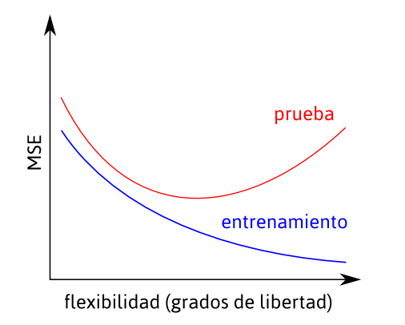
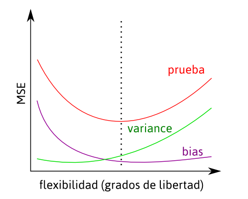

class: center, middle
background-color: #c39acd

### Colinealidad, selección de modelos y regularización


---
### ¿Qué significan las diferentes maneras de utilizar un modelo?

- Bajo el frecuentismo la *predicción* es solamente una subtarea dentro del marco general de 
la inferencia. 
- En el campo de **machine learning** es la aplicación fundamental.
- ¿Es posible que un modelo que no es fiel a la naturaleza haga mejores predicciones que uno 
que si lo es? **La respuesta sorprendente es SI**

---

### Dos objetivos:
- *Explicación:* encontrar el set de variables que sean más im portantes para explicar la variación 
en la respuesta.
- *Predicción:* la precisión de nuestras estimaciones serán mejores en un modelo con pocas variables.

<br>

### Implicancias filosóficas (lean a Kun Otsuka)
- *Estadística tradicional* identificar la uniformidad de la naturaleza.
- *Machine learning* (sensu stricto) considera los modelos como herramientas y evalúa su rol instrumental 
al momentode realizar predicciones. Enfoque *Pragmático*.

---
class: center, middle
background-color: #c39acd

## Paso previo 1: Colinealidad.

---

### modelo completo
```{r, eval=FALSE, echo=TRUE}
Call: lm(formula = CTPEA ~ MTE + FTE, data = dat)

Coefficients:
            Estimate  Std. Error t value  Pr(>|t|)
(Intercept) 66.5838   0.8275     80.461    < 2e-16 ***
MTE          2.2988   0.3363      6.835   1.26e-11 ***
FTE          2.3357   0.2968      7.869   7.53e-15 ***
---
Signif. codes: 0 ‘***’ 0.001 ‘**’ 0.01 ‘*’ 0.05 ‘.’ 0.1 ‘ ’ 1
Residual standard error: 9.655 on 1293 degrees of freedom
*Multiple R-squared: 0.1663, Adjusted R-squared: 0.1651*
F-statistic: 129 on 2 and 1293 DF, p-value: < 2.2e-16
```

---

### modelos por separado
```{r, eval=FALSE, echo=TRUE}
Call: lm(formula = CTPEA ~ MTE, data = dat)

Coefficients:
            Estimate   Std.Error t value Pr(>|t|)
(Intercept) 69.0110    0.7858     87.83   <2e-16 ***
MTE          3.8349    0.2802     13.68   <2e-16 ***
  
Residual standard error: 9.88 on 1294 degrees of freedom
*Multiple R-squared: 0.1264, Adjusted R-squared: 0.1257*
F-statistic: 187.3 on 1 and 1294 DF, p-value: < 2.2e-16


Call: lm(formula = CTPEA ~ FTE, data = dat)

Coefficients:
            Estimate   Std. Error t value  Pr(>|t|)
(Intercept) 69.3649    0.7332     94.60    <2e-16 ***
FTE          3.5134    0.2460     14.29    <2e-16 ***
  
Residual standard error: 9.825 on 1294 degrees of freedom
*Multiple R-squared: 0.1362, Adjusted R-squared: 0.1355*
F-statistic: 204.1 on 1 and 1294 DF, p-value: < 2.2e-16
```

---

### modelo con interacción
```{r, eval=FALSE, echo=TRUE}
Call: lm(formula = CTPEA ~ MTE * FTE, data = dat)

Coefficients:
            Estimate  Std. Error t value  Pr(>|t|)
(Intercept) 68.5897   1.6632     41.240   <2e-16 ***
MTE          1.3807   0.7411      1.863    0.0627 .
FTE          1.5474   0.6400      2.418    0.0158 *
MTE:FTE      0.3275   0.2356      1.390    0.1647
---
Signif. codes: 0 ‘***’ 0.001 ‘**’ 0.01 ‘*’ 0.05 ‘.’ 0.1 ‘ ’ 1
Residual standard error: 9.652 on 1292 degrees of freedom
*Multiple R-squared: 0.1676, Adjusted R-squared: 0.1657*
F-statistic: 86.7 on 3 and 1292 DF, p-value: < 2.2e-16
```

---

### Colinealidad

- La gente tiene cierta tendencia a encontrar pareja (y tener hijos) con gente que conoció mientras estudiaba. 
Solo esto ya genera una correlación en el nivel de educación de ambos padres.   
- Conocer el nivel de educación de la madre **nos da información** sobre el nivel de educación del padre (y viceversa).   

<br>

> Podríamos estar midiendo efectos indirectos si omitimos efectos directos del modelo. Añadir o quitar variables 
del modelo puede cambiar el valor de los parámetros estimados y su significancia.

---

### Colinealidad

- El cálculo de los coeficientes se vuelve sensible a pequeñas variaciones en los datos originales.
- En presencia de colinealidad los errores estándar de los coeficientes son mayores (se inflan), lo que afecta los test estadísticos sobre ellos.   
- Para pensarlo de manera sencilla, **si dos variables "independientes" están muy correlacionadas, es muy difícil determinar el efecto directo de cada una**.

---

### Cómo detectar la (multi)colinealidad
#### Inspeccionar la matriz de correlaciones (pingüinos de Palmer)

```{r, eval=TRUE, echo=FALSE, message=FALSE}
library(palmerpenguins)
library(knitr)
data(penguins); gentoo <- subset(penguins, penguins$species == "Gentoo")
m1 <- lm(body_mass_g ~ bill_length_mm + bill_depth_mm + flipper_length_mm,
data = gentoo)
mat <- cor(gentoo[, c("bill_length_mm", "bill_depth_mm", "flipper_length_mm")],
use="complete.obs")
kable(mat, digits = 3)
```

---

### Cómo detectar la (multi)colinealidad
#### Inspección gráfica
```{r, eval=TRUE, echo=FALSE, message=FALSE, fig.height= 5.5}
library(palmerpenguins)
data(penguins)
gentoo <- subset(penguins, penguins$species == "Gentoo")
pairs(gentoo[, c("bill_length_mm", "bill_depth_mm", "flipper_length_mm")],
col = 4, pch = 19)

```

---

### Cómo detectar la (multi)colinealidad
#### Utilizar factores de inflación de la varianza.

- La tolerancia ($t$) para la variable $X_{1}$ es sencillamente $1 – R^2$ de la 
regresión múltiple donde $X_{1}$ es tomada como variable respuesta y el resto de 
las variables $X$ como predictoras.   
- Los factores de inflación de la varianza (`vif`) son iguales al inverso de la 
tolerancia ($1/t$).   
- Se pueden tomar como límites 
  + $t < 0.1$ o $vif > 10$
  + $t < 0.2$ o $vif > 5$.    

---

### Cómo detectar la (multi)colinealidad
#### Utilizar factores de inflación de la varianza.

```{r, eval=TRUE, echo=FALSE, message=FALSE}
library(car)
library(knitr)
library(palmerpenguins)
data(penguins); gentoo <- subset(penguins, penguins$species == "Gentoo")
m1 <- lm(body_mass_g ~ bill_length_mm + bill_depth_mm + flipper_length_mm,
         data = gentoo)
vifes <- vif(m1)
kable(vifes, digits = 3)
```

---

### Más sobre la colinealidad.

- Una variable cualquiera $X$ siempre estará fuertemente correlacionada con el término cuadrático 
correspondiente $X^2$. Una posible solución para minimizar este efecto es centrar la variable 
X (restarle la media a cada valor, de modo que la nueva media sea 0).  
- Dos variables cualquiera $X, Z$ siempre estarán correlacionadas con su interacción. La 
colinealidad sólo se examina en modelos sin interacciones.
- *Es imposible remover la colinealidad por completo, es parte de la naturaleza de los datos.* 

---
class: center, middle
background-color: #c39acd

## Paso previo 2: Entrenamiento y prueba.

---

### Training & Test 
Datos de entrenamiento y datos de prueba   

* Todo nuestro modelado se basa en la minimización de los residuos.   
* ¿Son los únicos (o los mejores) residuos disponibles?   
* ¿Es el único (o el mejor) modelo para estos datos? 
* ¿Qué pasaría si minimizo los residuos *hasta que no quede nada*?

---

### Training & Test 

```{r, comment=NA, echo=FALSE, highlight=TRUE}
set.seed(1234)
X <-rnorm(100, mean = 10, sd=20)
Y <- 100 + 0.25*X + 0.019*X^2 + rnorm(100, 0, 10)
plot(X, Y, pch =19)
```

---

### Training & Test 
Modelos sucesivamente más complejos      

```{r, comment=NA, echo=TRUE, highlight=TRUE}
set.seed(1234)
X <-rnorm(100, mean = 10, sd=20)
Y <- 100 + 0.25*X + 0.019*X^2 + rnorm(100, 0, 10)
fit1 <- lm(Y ~ X) 
fit2 <- lm(Y ~ poly(X, 2)) 
fit3 <- lm(Y ~ poly(X, 10)) 
summary(fit1)$r.squared #LINEAL
summary(fit2)$r.squared #CUADRÁTICO
summary(fit3)$r.squared #POLINOMIO GRADO 10
```

---

### Training & Test 
Modelos sucesivamente más complejos 

```{r, comment=NA, echo=FALSE, highlight=TRUE}
set.seed(1234)
X <-rnorm(100, mean = 10, sd=20)
Y <- 100 + 0.25*X + 0.019*X^2 + rnorm(100, 0, 10)
fit1 <- lm(Y ~ X) 
fit2 <- lm(Y ~ poly(X, 2)) 
fit3 <- lm(Y ~ poly(X, 10)) 
plot(X, Y, pch =19)
newx <- seq(min(X), max(X), length.out = 200)
points(newx, predict(fit1, data.frame(X = newx)), lwd = 2, type = "l")
points(newx, predict(fit2, data.frame(X = newx)), lwd = 2, col = "blue", type = "l")
points(newx, predict(fit3, data.frame(X = newx)), lwd = 2, col = "red", type = "l")
```

---

### Training (50 datos)   
```{r, comment=NA, echo=FALSE, highlight=TRUE}
set.seed(1234)
X <-rnorm(100, mean = 10, sd=20)
Y <- 100 + 0.25*X + 0.019*X^2 + rnorm(100, 0, 10)
s <- sample(1:100, 50)
xs <- X[s]
fit1 <- lm(Y[s] ~ xs) 
fit2 <- lm(Y[s] ~ poly(xs, 2)) 
fit3 <- lm(Y[s] ~ poly(xs, 10)) 
plot(xs, Y[s], pch =19)
newx <- seq(min(X), max(X), length.out = 200)
points(newx, predict(fit1, data.frame(xs = newx)), lwd = 2, type = "l")
points(newx, predict(fit2, data.frame(xs = newx)), lwd = 2, col = "blue", type = "l")
points(newx, predict(fit3, data.frame(xs = newx)), lwd = 2, col = "red", type = "l")
```

---

### Test (50 datos)   
```{r, comment=NA, echo=FALSE, highlight=TRUE}
set.seed(1234)
X <-rnorm(100, mean = 10, sd=20)
Y <- 100 + 0.25*X + 0.019*X^2 + rnorm(100, 0, 10)
s <- sample(1:100, 50); n <- c(1:100)[-s]
xs <- X[s]
fit1 <- lm(Y[s] ~ xs) 
fit2 <- lm(Y[s] ~ poly(xs, 2)) 
fit3 <- lm(Y[s] ~ poly(xs, 10)) 
plot(X[n], Y[n], col ="grey50", pch =19)
newx <- seq(min(X), max(X), length.out = 200)
points(newx, predict(fit1, data.frame(xs = newx)), lwd = 2, type = "l")
points(newx, predict(fit2, data.frame(xs = newx)), lwd = 2, col = "blue", type = "l")
points(newx, predict(fit3, data.frame(xs = newx)), lwd = 2, col = "red", type = "l")
```

---

### Test (50 datos). RSSP   

```{r, comment=NA, echo=FALSE, highlight=TRUE}
set.seed(1234)
X <-rnorm(100, mean = 10, sd=20)
Y <- 100 + 0.25*X + 0.019*X^2 + rnorm(100, 0, 10)
s <- sample(1:100, 50); n <- c(1:100)[-s]
xs <- X[s]; ys <- Y[s]
xn <- X[n]; yn <- Y[n]
fit1 <- lm(ys ~ xs) 
fit2 <- lm(ys ~ poly(xs, 2)) 
fit3 <- lm(ys ~ poly(xs, 10)) 
plot(X[n], Y[n], col ="grey50", pch =19)
newx <- seq(min(X), max(X), length.out = 200)
points(newx, predict(fit1, data.frame(xs = newx)), lwd = 2, type = "l")
points(newx, predict(fit2, data.frame(xs = newx)), lwd = 2, col = "blue", type = "l")
points(newx, predict(fit3, data.frame(xs = newx)), lwd = 2, col = "red", type = "l")
o <- order(xn)
segments(xn[o], predict(fit1, data.frame(xs = xn))[o], xn[o], yn[o])
segments(xn[o]+0.5, predict(fit2, data.frame(xs = xn))[o], xn[o]+0.5, yn[o], col = "blue")
segments(xn[o]+1, predict(fit3, data.frame(xs = xn))[o], xn[o]+1, yn[o], col = "red")
```

---

### RSSP   
```{r, comment=NA, echo=FALSE, highlight=TRUE}
set.seed(1234)
X <-rnorm(100, mean = 10, sd=20)
Y <- 100 + 0.25*X + 0.019*X^2 + rnorm(100, 0, 10)
s <- sample(1:100, 50); n <- c(1:100)[-s]
xs <- X[s]; ys <- Y[s]
xn <- X[n]; yn <- Y[n]
fit1 <- lm(ys ~ xs) 
fit2 <- lm(ys ~ poly(xs, 2)) 
fit3 <- lm(ys ~ poly(xs, 10)) 
res1 <- sum((resid(fit1))^2)
res2 <- sum((resid(fit2))^2)
res3 <- sum((resid(fit3))^2)
resp1 <- sum((yn - predict(fit1, data.frame(xs = xn)))^2)
resp2 <- sum((yn - predict(fit2, data.frame(xs = xn)))^2)
resp3 <- sum((yn - predict(fit3, data.frame(xs = xn)))^2)
dat <- data.frame(modelo = c("lineal", "cuadratico", "polinomio10",
                             "lineal", "cuadratico", "polinomio10"),
                  method = c("training","training","training",
                             "test", "test", "test"),
                  RSS = c(res1, res2, res3, resp1, resp2, resp3))
dat$modelo = factor(dat$modelo, levels = c("lineal", "cuadratico", "polinomio10"))
interaction.plot(dat$modelo, dat$method, log(dat$RSS),
                 trace.label = "datos", xlab = "modelo", ylab= "log(RSS)",
                 col = c("black", "red"))

```

---

### MSE para datos de prueba y entrenamiento



---

### Varianza y Sesgo

- **Varianza**. Cómo puede cambiar el modelo con diferentes datos de entrenamiento. 
Modelos menos flexibles (más sencillos) tienen menos varianza.   
- **Sesgo**. Error introducido al momento de enfrentar la vida real (que puede ser 
extremadamente complicada), utilizando un modelo sencillo.   

---

### Varianza y Sesgo



---
class: center, middle
background-color: #c39acd

## Paso previo 3: Verosimilitud

---

### Verosimilitud

- $L$ mide cuán bien un modelo estadístico explica los datos observados, calculando la 
probabilidad de observar estos datos bajo diferentes valores de parámetros. 
- Es un método para obtener el valor de de los parámetros, pero a diferencia de otros 
como los *mínimos cuadrados* que ya vimos, es un método por aproximación.
-  Puede maximizarse hasta explicar *absolutamente* los datos (**overfitting**). 
- Aumentar el número de variables (parámetros) es equivalente a incrementar la 
complejidad del modelo.

---
class: center, middle
background-color: #c39acd

## Ahora si. Selección de modelos


---

### Tres métodos (de los que vemos dos)

- *Selección basada en criterios*  
- *Shrinkage*. Modelo donde algunos parámetros son "reducidos" a cero.   
- *Reducción de dimensiones*. Proyección de las variables en un espacio de menores 
dimensions (por ej. PCA).   

---

### Selección basada en criterios

$$AIC = -2 log(likelihood) + 2p$$   

$$BIC = -2 log(likelihood) + log(n)p$$    

> Existe una fauna de criterios muy variada: Cp, DIC, AICc, BICc, $R^2_{adj}$ etc.
> Akaike es una medida de la *performance* predictiva promedio.

---

#### Selección de modo *forward*   
Al modelo sólo con intercepto se le incorpora un creciente número de variables, hasta 
que la adición no provoca mejoras en el criterio elegido. El anteúltimo modelo es por 
lo tanto el mejor.   

#### Selección de modo *backward*   
Al modelo más completo posible se le remueven variables hasta que la adición no provoca 
mejoras en el criterio elegido. El último modelo es por lo tanto el mejor.

#### Búsqueda exhaustiva
Se construyen todos los modelos posibles y se elige el mejor de acuerdo a cierto 
criterio.   

#### Promediado de modelos
Se construyen todos los modelos posibles y se presenta el set de mejores modelos, 
dentro de determinado rango de criterios.

---

### ¿Por qué usamos criterios y no significancia?


https://xkcd.com/882/

---
background-color: #c39acd

### Shrinkage 

$$RSS = \sum_{i = 1}^{n}(y_i - \beta_0 - \sum_{j = 1}^{p} \beta_jx_{ij})^2$$


#### Ridge regression   

$$RSS + \lambda \sum_{j = 1}^{p} \beta_j^2$$


#### Lasso (least absolute shrinkage selector operator)
$$RSS + \lambda \sum_{j = 1}^{p} |\beta_j|$$

---

### Ridge regression y Lasso

* Estiman una suma de cuadrados penalizada. 
* El efecto es contraer los estimadores de $\beta_{i}$ hacia cero (excepto el intercepto). 
* Lasso sobresale porque logra que los estimadores de algunas variables se vuelvan 
exactamente cero, por lo que realiza a la vez selección de variables y de modelos.
* Ambos requieren ajustar un parámetro de "afinado" por validación cruzada.

---

